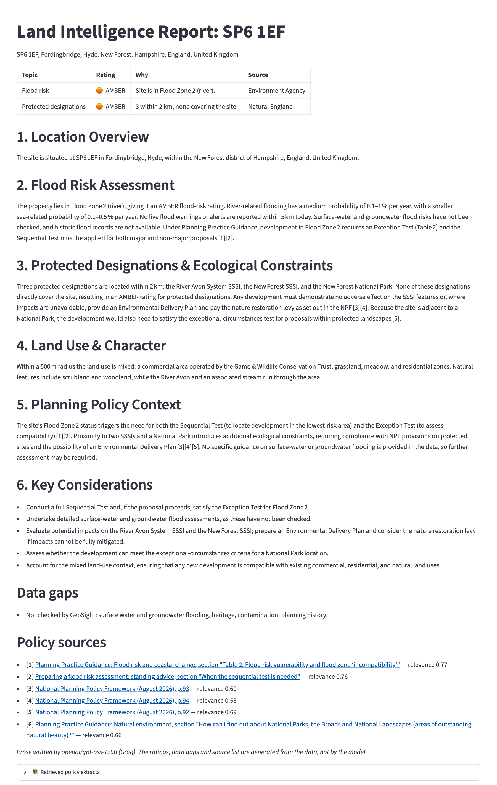

# 🗺️ GeoSight — UK Land Intelligence

> Enter a UK postcode and get a site report covering flood risk, protected designations,
> land use and planning policy, with every rating and citation traceable to its source.

[](https://github.com/ssabeeth/geosight/actions/workflows/ci.yml)


**Live demo:** [geosight.streamlit.app](https://geosight.streamlit.app) (runs on Groq; the first load can take a minute while the app wakes up)


---

## What it does

GeoSight is a LangGraph pipeline. For a postcode and an optional site photo it:

1. **Geocodes** the postcode (postcodes.io, with OpenStreetMap Nominatim as a fallback)
2. **Looks up flood risk** from two Environment Agency sources: the planning **flood zone** at the site, and **live warnings** within 5 km
3. **Finds protected designations** (SSSIs, National Landscapes, NNRs, National Parks) within a true 2 km radius, and whether any covers the site (Natural England)
4. **Lists land use** within 500 m (OpenStreetMap Overpass)
5. **Describes a site photo** with a vision model, if one is uploaded
6. **Retrieves planning policy** with RAG over four current government documents, using one query per report topic
7. **Writes a report** with RED/AMBER/GREEN ratings, a data-gaps section and numbered sources

The tools run in a fixed order; only the photo step is conditional.

---

## How the report stays grounded

An earlier version let the model write everything. Given a Fordingbridge postcode it invented
"on-the-ground observations" with no photo uploaded, cited page numbers as paragraph numbers,
and rated a site on the River Avon GREEN because no flood warning was in force that day.
The report is now split between code and model:

| Part of the report | Decided by | How |
|---|---|---|
| RED/AMBER/GREEN ratings | Rules in [`report.py`](geosight/report.py) | Flood Zone 3 → RED, Zone 2 → AMBER; inside a designation → RED, within 2 km → AMBER; failed lookup → NOT RATED |
| Missing data | Code | Anything that failed is marked `NOT AVAILABLE — do not infer` in the prompt and listed under **Data gaps** |
| Source list | Code | Built from what retrieval returned, with the page (PDF) or section heading (web page) and a link |
| Prose | The model | Told to use only the data, keep the fixed ratings and cite only as `[n]` |
| Checks on the prose | Code | Citation numbers outside the source list are removed; paragraph numbers not found in the sources, ratings that contradict the rules, and a report citing nothing are all shown as warnings |

If the model fails entirely, the app still shows the ratings, data gaps and sources, plus a
warning. Warnings are shown open, not collapsed.



---

## Architecture

```
Postcode (+ optional photo)
        │
        ▼
geocode → flood_risk → protected_areas → land_use ─┬─ vision (if photo) ─┐
                                                   └─────────────────────┴─→ rag → synthesise
                                                                                     │
          ratings, data gaps and sources (rules)  +  prose (LLM)  +  checks  ◄───────┘
                                                                                     │
                                                                                     ▼
                                                                          Streamlit report
```

| Component | Technology |
|---|---|
| Orchestration | LangGraph |
| Text model | Ollama `llama3.2:3b` locally, or Groq `openai/gpt-oss-120b` |
| Vision model | Ollama `llava:7b` locally, or Groq `qwen/qwen3.8-27b` |
| Embeddings | `sentence-transformers/all-MiniLM-L6-v2` |
| Vector store | FAISS (committed, 415 chunks) |
| Data | postcodes.io, Environment Agency, Natural England, OpenStreetMap: all free, no keys |
| UI | Streamlit + Folium |

---

## Run it

### With local models (free, no keys)
```bash
# Install Ollama from ollama.com, then:
ollama pull llama3.2:3b
ollama pull llava:7b

git clone https://github.com/ssabeeth/geosight
cd geosight
python3.11 -m venv .venv
source .venv/bin/activate
pip install -e ".[dev]"
cp .env.example .env
streamlit run app.py
```

### With Groq
Set `GROQ_API_KEY` in `.env` (a free key from [console.groq.com](https://console.groq.com)).
When a key is set, both text and vision go to Groq; the model names can be changed with
`GROQ_MODEL` and `GROQ_VISION_MODEL`. The live demo runs this way.

The 3B local model follows the fixed ratings but writes weaker prose and often cites nothing;
the app flags that. Groq's larger model cites consistently.

### Tests
```bash
pytest          # 47 tests, all offline: HTTP is mocked and the model is faked
ruff check .
python scripts/smoke.py "SP6 1EF"   # one real end-to-end run against the live APIs
```

CI runs lint and the tests on every push.

### Rebuilding the policy index
The index is committed, so this is only needed after changing the documents:
```bash
python scripts/build_index.py
```
The build stops if any document fails to download. An earlier version skipped failures
silently and shipped an index holding one document out of four.

---

## Example ratings

| Postcode | Place | Flood risk | Protected designations |
|---|---|---|---|
| TQ13 8HH | Throwleigh, Dartmoor | 🔴 Flood Zone 3 (river) | 🔴 Inside Dartmoor National Park; North Dartmoor SSSI within 2 km |
| SO41 8DQ | Lymington | 🔴 Flood Zone 3 (river) | 🟠 3 within 2 km: two SSSIs and the New Forest National Park |
| SP6 1EF | Fordingbridge | 🟠 Flood Zone 2 (river) | 🟠 3 within 2 km: River Avon System SSSI, The New Forest SSSI, New Forest National Park |
| E1 6RF | Whitechapel, London | 🟢 Flood Zone 1 | 🟢 None within 2 km |

Checked on 23 September 2026. Live warnings change daily, so a report can move to RED when a
flood warning is in force.

---

## Document corpus

| Document | Publisher | Version indexed |
|---|---|---|
| National Planning Policy Framework | MHCLG | August 2026 (PDF, chunked by page) |
| Planning Practice Guidance: Flood risk and coastal change | MHCLG | GOV.UK page, chunked by section |
| Preparing a flood risk assessment: standing advice | Environment Agency | GOV.UK page, updated May 2026 |
| Planning Practice Guidance: Natural environment | MHCLG | GOV.UK page |

The GOV.UK pages are fetched through the [GOV.UK Content API](https://content-api.publishing.service.gov.uk/),
so each chunk keeps its section heading for citation.

---

## Known limitations

- **The location is the postcode's centre point.** A postcode can cover several streets; the flood zone and "covers the site" checks use one point.
- **Flood zones cover rivers and the sea only.** Surface water, groundwater and historic flooding aren't checked, and the report says so.
- **The model can still misread policy.** Given SP6 1EF, it said Flood Zone 2 always needs an Exception Test; the flood-risk table it cites says that only applies to highly vulnerable uses. The citation points to the right table, so a reader can check.
- **Fixed tool order.** The model doesn't choose which tools to call; the pipeline runs them all.
- **No evaluation set yet.** The checks catch fabricated citations and contradicted ratings, but nothing yet scores the prose against known answers.

---

## Data sources

- **Flood zones and warnings**: © Environment Agency. Open Government Licence v3.0.
- **Protected areas**: © Natural England. Open Government Licence v3.0.
- **Postcode locations**: [postcodes.io](https://postcodes.io). Contains OS data © Crown copyright and database right; Royal Mail data © Royal Mail copyright and database right; ONS data under the Open Government Licence v3.0.
- **Land use and fallback geocoding**: © OpenStreetMap contributors. ODbL.
- **Policy documents**: © Crown copyright. Open Government Licence v3.0.

---

## Author

**Syed Sabeeth Shoeb** — [LinkedIn](https://linkedin.com/in/syed-sabeeth) · [GitHub](https://github.com/ssabeeth)

## Licence

MIT
